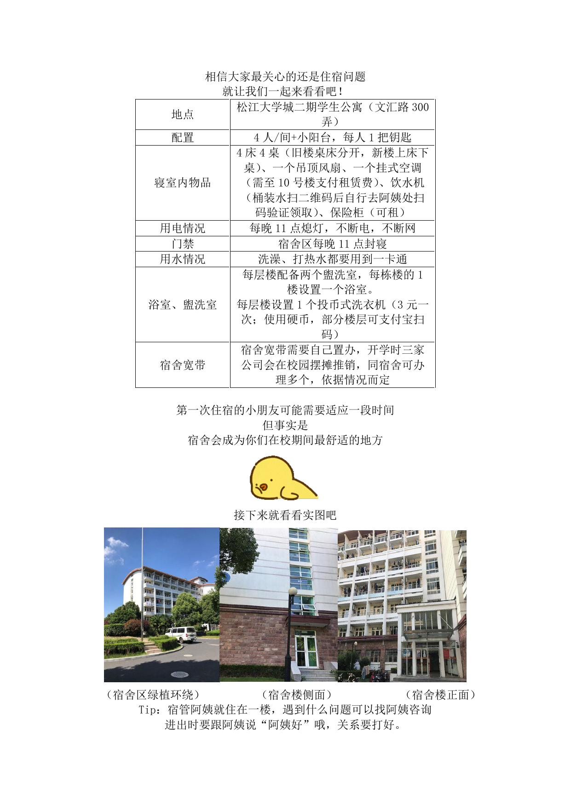
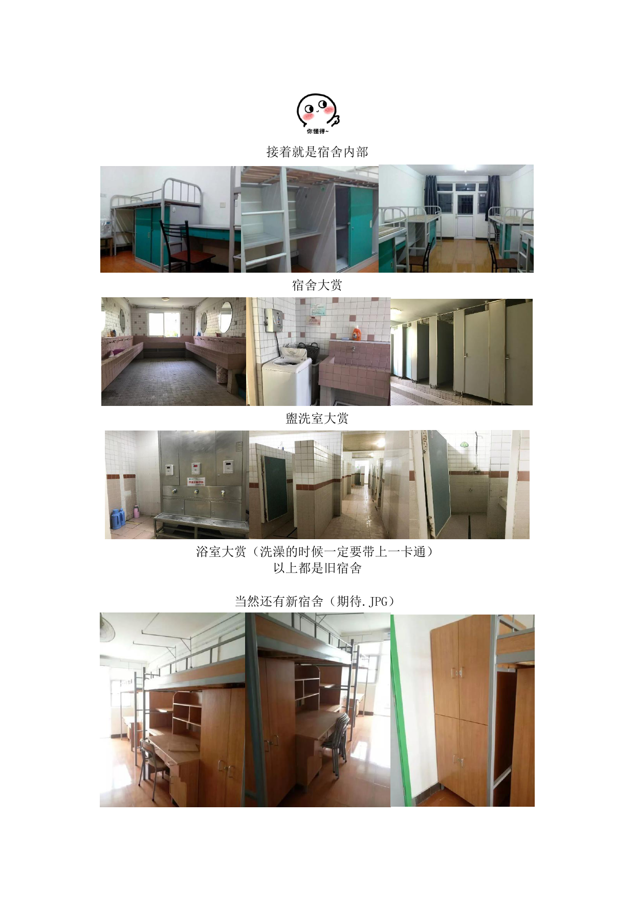
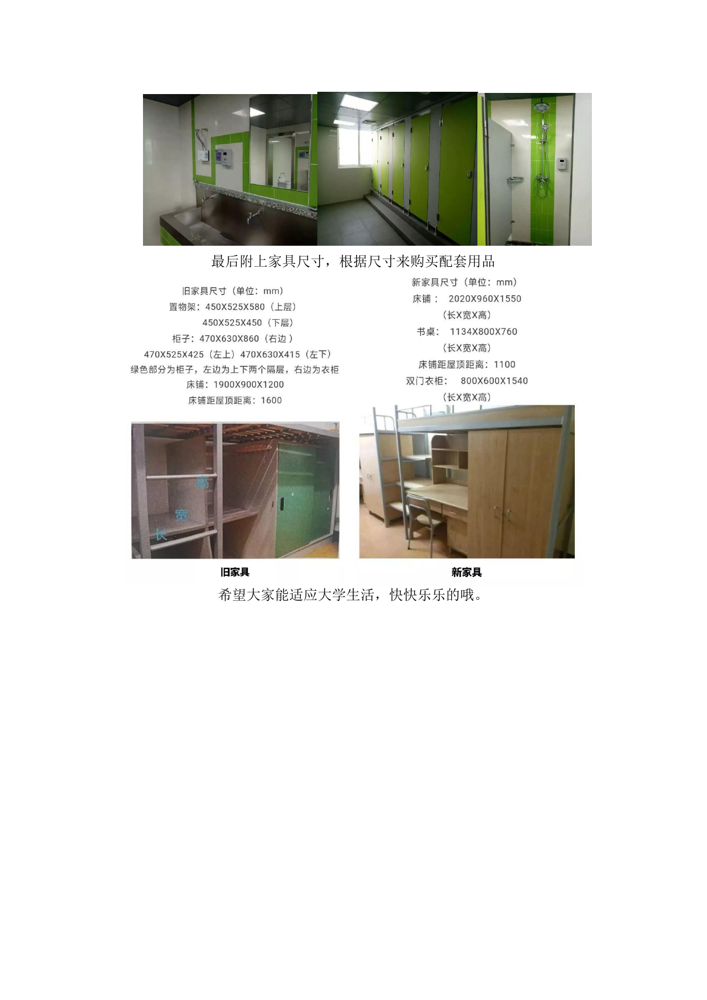

# 宿舍生活

## 各校区宿舍分布

- **松江校区**：纺织学院、机械工程学院、信息科学与技术学院、计算机科学与技术学院、材料科学与工程学院、化学与化工学院、生物与医学工程学院、环境科学与工程学院、物理学院、数学与统计学院、外语学院。
- **延安路校区**：服装与艺术设计学院、上海国际时尚创意学院、旭日工商管理学院、人文学院。

## 松江校区宿舍概况

松江校区宿舍位于**松江大学城二期学生公寓**（文汇路 300 弄）。以 4 人间为主，带小阳台。每人一把钥匙。**旧宿舍楼为桌床分开，新宿舍楼为上床下桌**，按楼栋随机分配。宿舍区和教学区之间约有 1 公里。

> 以下为宿舍实拍图：

### 基本配置

| 设施 | 说明 |
|------|------|
| 空调 | 挂式空调，需到 10 号楼支付租赁费办理 |
| 风扇 | 每间宿舍配有一个吊顶风扇 |
| 热水 | 浴室在宿舍楼**一楼**（无独立卫浴），洗澡需刷一卡通 |
| 洗衣机 | 每层楼 1 个投币式洗衣机（3 元/次，使用硬币） |
| 饮水 | 宿舍内配饮水机，桶装水扫码后去阿姨处验证领取 |
| 网络 | 宿舍区**不覆盖校园网**，需自行办理宽带 |
| 用电 | 不断电不断网；每晚约 23:00 熄灯（不影响插座和空调） |
| 保险柜 | 可自愿租赁 |

### 宿舍规定

!!! warning "安全须知"
    - **门禁时间**：每晚 12:00 前，晚归需登记
    - **违规电器**：禁止使用 ≥400W 的大功率电器（吹风机需用宿舍专用低功率款）
    - **用电安全**：拖线板和电器需放置在桌上，不可放置床上；离开宿舍需切断电源
    - **查寝**：阿姨会定期检查宿舍卫生及用电安全（一般不查人数）

!!! info "卫生建议"
    - 共同购买清扫工具，制定值日表
    - 及时清理垃圾，外卖餐盒不过夜
    - 公共卫浴使用后及时冲水
    - 建议宿舍协商制定卫生公约

### 生活贴士

| 项目 | 建议 |
|------|------|
| 床铺尺寸 | 一般为长 1.9m × 宽 0.9m × 高 1.1m（上床下桌）；部分上下铺宿舍上铺高度约 0.9m，建议选好床帘、蚊帐等尺寸相关的用品**到宿舍后再买**，或购买宽高可伸缩款式 |
| 床上用品 | 可自带或到校购买，可提前寄送到宿舍地址 |
| 快递寄送 | 查到宿舍安排后再寄快递，合理安排时间 |
| 家长入校 | 可入校，进宿舍需在宿管处报备（异性家长尤其注意） |
| 提前入住 | 可提前到（如报到前一两天打扫卫生），不建议过早 |

### 宿舍费用

住宿费统一为 **1200 元/学年**。学费因专业不同而异（6500-58000 元/学年），请以录取通知书为准。此外还需缴纳上海市大学生城镇基本医疗保险费（年底按上海市政策缴纳）。

!!! info "办理提示"
    - 报到当天基本就把**空调和宽带**办好了
    - 校园一卡通（饭卡/学生卡）在报到时发放
    - **电话卡**（校园电话卡）注意不要被推销忽悠，资费请自行了解清楚
    - 常见忽悠话术："不办卡不能选课"、"不办卡不能访问校园网"——**这些都是假的**，校外访问校内资源仅需挂校园 VPN

### 床铺下床方向

男生宿舍部分楼栋从两侧（宽 0.9m 的那侧）上床，部分从长边上床，具体分到宿舍后确认。购买床帘、蚊帐时建议到宿舍后量好尺寸再下单，或购买可伸缩款式。

## 延安路校区宿舍概况

延安路校区位于上海市中心长宁区，宿舍条件各异，部分楼栋为上下铺。

## 室友相处指南

!!! tip "和谐宿舍小建议"
    - 开学初就约定好作息时间、卫生分工等基本规则
    - 互相尊重隐私与生活习惯差异
    - 有问题及时沟通，避免积怨
    - 可以一起探索校园、约饭增进感情
    - 宿舍是公共空间，打电话/外放请戴耳机

## 宿舍好物推荐

<!-- TODO: 收集同学们的宿舍生活好物推荐 -->

> **待贡献者补充**：如果你了解某个宿舍楼的详细信息，或有宿舍生活的好建议，欢迎在评论区留言或提交 PR！

